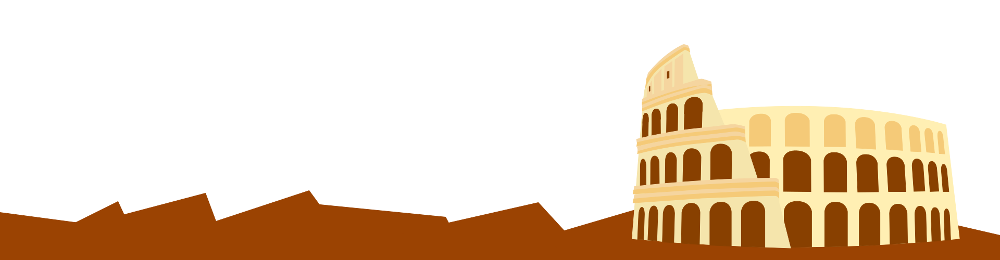

<p align="center">
  
</p>

# PyRoma Meetup - Sito Web

**PyRoma** è la community dei Pythonisti di Roma! ✨

Promuoviamo la crescita, la formazione e il networking per chiunque sia interessato a Python, data science, AI, web e sviluppo software. Organizziamo incontri (meetup), talk, coding night, laboratori e serate informali, tutto rigorosamente _open_ e per chiunque abbia curiosità sul linguaggio e le sue evoluzioni.



---

## 🚀 Link utili e social
- 🐦 [Twitter @pyroma](https://twitter.com/pyroma)
- ✈️ [Telegram: t.me/pyroma](https://t.me/pyroma)
- 💌 [Mailing list PyRoma](https://lists.python.it/mailman/listinfo/pyroma)
- 💻 [Github](https://github.com/pyroma)

---

## ℹ️ Cosa trovi nel sito?
Il sito contiene:
- Anteprima aggiornata del prossimo evento (dati da `event.html`)
- Sezione social e contatti rapidi
- Tutti gli asset statici per la brand/identity PyRoma

---

## 💡 Come aggiungere/cambiare evento
1. Modifica o aggiungi un `<div class="event-data">` dentro il file `event.html`.
2. Salva e ricarica la pagina (`index.html`) - la preview verrà aggiornata automaticamente!

---

## 🤝 Come contribuire
1. Fai fork del repo, crea la tua branch e proponi pull request!
2. Per domande o suggerimenti usa Telegram, Github Issues o la mailing list.

---

## 🛠️ HOW TO CONTRIBUTE: Modifica eventi dinamici

Vuoi aggiungere o aggiornare un evento che compare in homepage? È facilissimo!

1. Apri il file `event.html` nella root del progetto.
2. Ogni evento è rappresentato da un blocco come questo (puoi duplicarlo e cambiare i dati):

```html
<div class="event-data" style="display:none"
     data-title="Titolo dell'evento"
     data-date="Data, ora"
     data-location="Luogo, indirizzo, città"
     data-description="Breve descrizione dell'evento, max 240 caratteri."
     data-link="https://linkall'evento.com">
</div>
```

3. Inserisci i dati relativi al nuovo evento nei rispettivi attributi `data-*`.
4. Salva il file: visitando la homepage, il nuovo evento comparirà in automatico nella preview (puoi aggiungere quanti blocchi vuoi!).
5. La preview viene aggiornata in tempo reale, senza modificare il resto del sito!

- **Nota:** Se vuoi nascondere temporaneamente un evento, basta commentare il blocco corrispondente con `<!-- ... -->`.

---

<p align="center">
  
</p>

---

**Made with ❤️ by la community PyRoma. Vieni a trovarci!**
